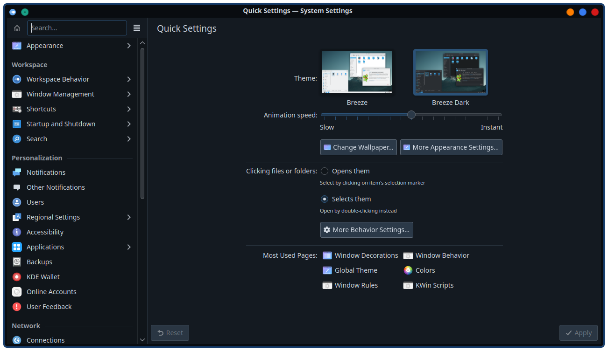
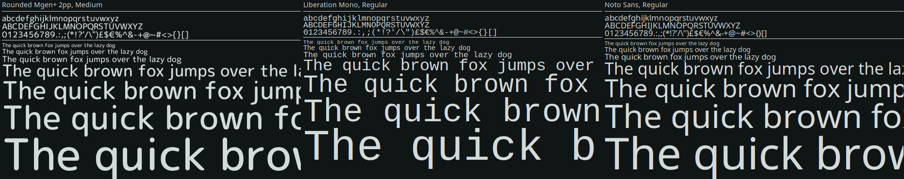

# kde5-rice-themes
> **Repo for theme files and config for my KDE Plasma 5.27 Rice** 
> This theme started from me lining the Aritim Dark Plasma theme.
---
## Navigation
- [**Previews**](#previews)
- [**DE Themes**](#de-themes)
    - [**Plasma Theme**](#plasma-theme)
    - [**Aurorae Theme**](#aurorae-theme) (Window Decorations)
    - [**Color Scheme**](#color-scheme)
    - [**Fonts**](#fonts)
    - [**Icons**](#icons)
    - [**Cursors**](#cursors)
    - [**Splash Screen**](#splash-screen)
    - [**GTK Theme**](#gtk-theme)
- [**Software Themes**](#software-themes)
    -[**qBitTorrent Theme**](#qbittorrent-theme)

---
## Previews

    
DE Themes

    

        
<b>Plasma Theme</b>

         
        
    

    

        
<b>Aurorae & Color Scheme</b>

         
        
    

    

        
<b>Fonts</b>

         
        
    

    

        
<b>Icons</b>

         
        
    

    

        
<b>Cursors</b>

         
        
         
        
    

    

        
<b>Splash Screen</b>

         
        
    

    

        
<b>GTK Theme</b>

         
        
    

    
Software Themes

 

## DE Themes

### Plasma Theme
> [**Aritim Dark Rounded Blur**](https://store.kde.org/p/1534788)

### Aurorae Theme
> Located in: `desktop-environment/aurorae` 
> Based on: 
> Buttons used from:

> Install dir: `~/.local/share/aurorae/themes`

### Color Scheme
> Located in: `desktop-environment/color-schemes` 
> Based on the main color of the Plasma Theme with some modifications

> Install dir: `~/.local/share/color-schemes/`

### Fonts
> **Regular Font:** Noto Sans 
> **Monospace Font:** Liberation Mono 
> **Clock Font:** Rounded Mgen++ 2pp Medium (With pipe (|) centered) | `desktop-environment/clock-font`

### Icons
> [**Tela Icon Theme**](https://www.pling.com/p/1279924/) | **Flavor:** Nord Dark

### Cursors
> [**Bibata Modern Classic**](https://store.kde.org/p/1914825/) or [**Bibata Modern Ice**](https://store.kde.org/p/1197198)

### Splash Screen
> Located in: `desktop-environment/look-and-feel` 
> Based on: [**Kuro**](https://store.kde.org/p/1871277) 
> Modifications: Changed Background Color to Aritim Theme

### GTK Theme
*Will be Custom Later* 
> [**Aritim Dark**](https://www.gnome-look.org/p/1291666)

## Software Themes
> Located in: `software/qbittorrent` 
> Based on [**Dracula Theme**]() 

### qBitTorrent Theme

### BetterDiscord/Vencord Theme

### VSCode Theme

### Yakuake Theme

### Konsole Profile

### JamesDSP Theme

### Kate Theme