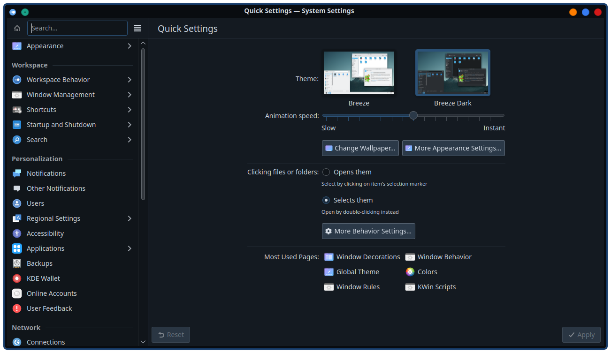
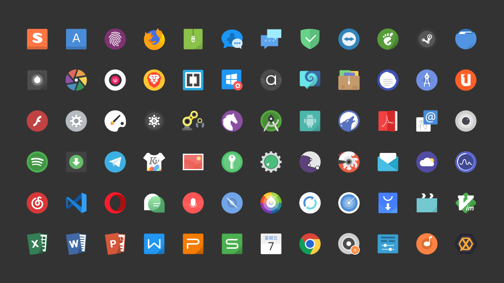
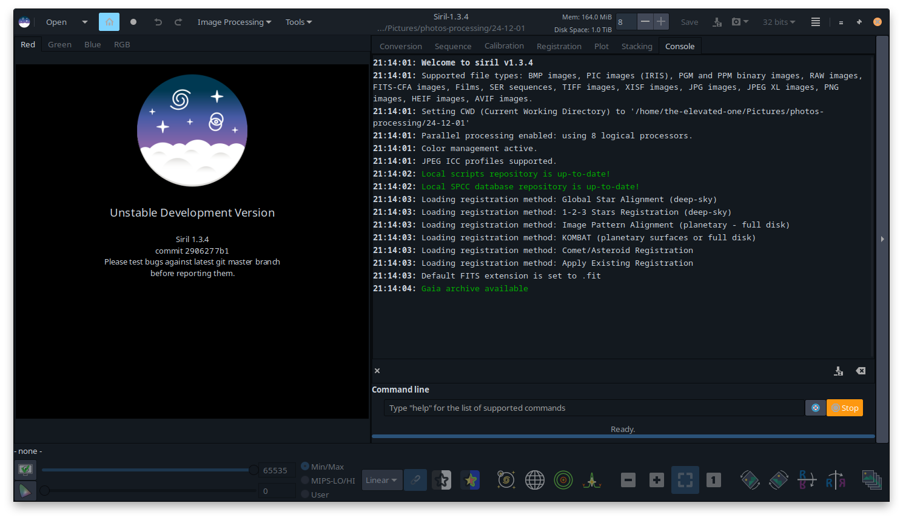
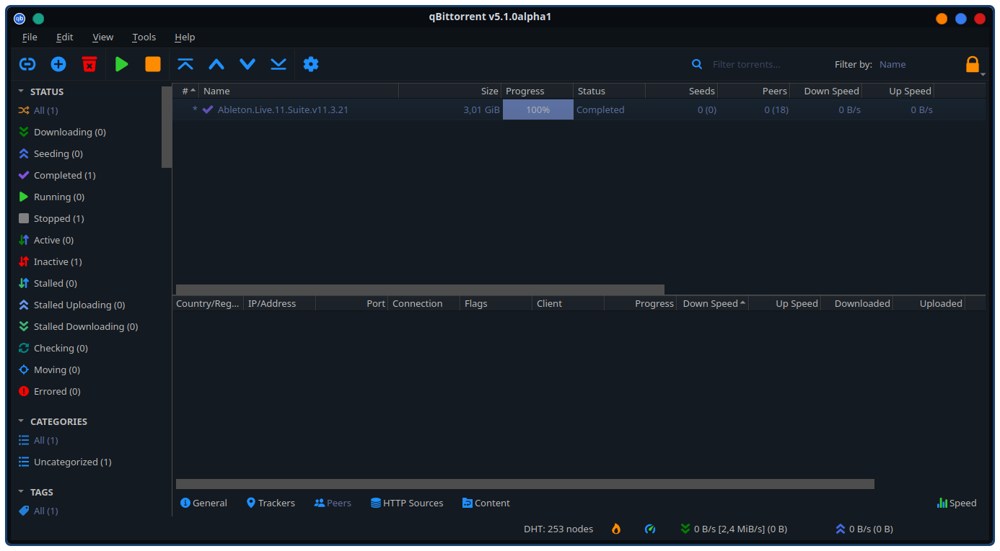
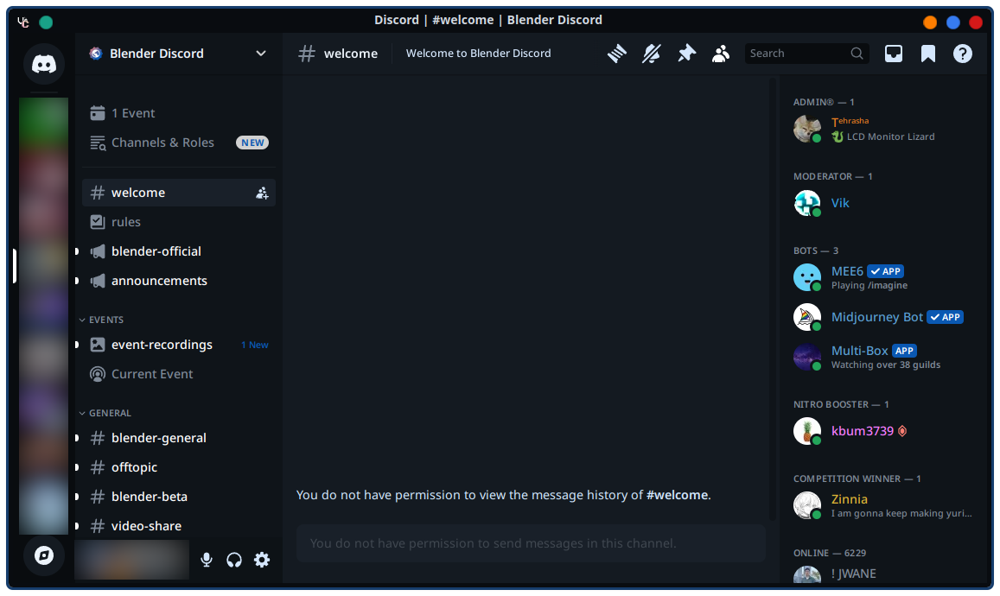

# kde5-rice-theme
> **Repo for theme files and config for my KDE Plasma 5.27 Rice** 
> This theme started from me liking the Aritim Dark Plasma theme.
### Disclaimer:
- Any `Install dir` path is for a local package (**for Ubuntu** eg. installed via apt, .deb file or built from source)
- I don't know flatpak and snap config dirs since I don't use them that often
---
## Navigation
- [**Previews**](#previews)
- [**DE Themes**](#de-themes)
    - [**Plasma Theme**](#plasma-theme)
    - [**Aurorae Theme**](#aurorae-theme) (Window Decorations)
    - [**Color Scheme**](#color-scheme)
    - [**Fonts**](#fonts)
    - [**Icons**](#icons)
    - [**Cursors**](#cursors)
    - [**Splash Screen**](#splash-screen)
    - [**GTK Theme**](#gtk-theme)
- [**Software Themes**](#software-themes)
    - [**qBitTorrent Theme**](#qbittorrent)

---
## Previews

    
<b>DE Themes</b>

    

    <ul>
        <li>
            

                
<b>Plasma Theme</b>

                 
                
            

        </li>
        <li>
            

                
<b>Aurorae & Color Scheme</b>

                 
                
            

        </li>
        <li>
            

                
<b>Fonts</b>

                 
                
            

        </li>
        <li>
            

                
<b>Icons</b>

                 
                
            

        </li>
        <li>
            

                
<b>Cursors</b>

                 
                
                 
                
            

        </li>
        <li>
            

                
<b>Splash Screen</b>

                 
                
            

        </li>
        <li>
            

                
<b>GTK Theme</b>

                 
                
            

    </ul>

    
<b>Software Themes</b>

    

    <ul>
        <li>
            

                
<b>qBitTorrent</b>

                 
                
Rebuilt qBitTorrent with a custom logo, since the original is shit imo.

                
            
    
        </li>
        <li>
            

                
<b>BetterDiscord/Vencord</b>

                 
                
            
    
        </li>
        <li>
            

                
<b>VSCode</b>

                 
                
            
    
        </li>
        <li>
            

                
<b>Yakuake & Konsole</b>

                 
                
            
    
        </li>
        <li>
            

                
<b>JamesDSP</b>

                 
                
            
    
        </li>
    </ul>

## DE Themes
> Anything directly from KDE Store recommended installation via `System Settings - Get New Themes` or `ocs-url`

### Plasma Theme
- [**Aritim Dark Rounded Blur**](https://store.kde.org/p/1534788)  
- **Install dir:** `~/.local/share/plasma/desktoptheme`

### Aurorae Theme
- **Located in:** `desktop-environment/aurorae` 
- **Based on:** [**Aritim-Dark**](https://store.kde.org/p/1320512) 
- **Buttons used from:** [**Flat Remix Darkest Aurorae**](https://store.kde.org/p/1315475)  
- **Install dir:** `~/.local/share/aurorae/themes`

### Color Scheme
- **Located in:** `desktop-environment/color-schemes` 
- **Based on:** Aritim Dark Accent Color  
- **Install dir:** `~/.local/share/color-schemes/`

### Fonts
- **Regular Font:** Noto Sans 
- **Monospace Font:** Liberation Mono 
- **Clock Font:** Rounded Mgen++ 2pp Medium (With pipe (|) centered) | `desktop-environment/clock-font`

### Icons
- [**Tela Icon Theme**](https://www.pling.com/p/1279924/) | **Flavor:** Nord Dark

### Cursors
- [**Bibata Modern Classic**](https://store.kde.org/p/1914825/) or [**Bibata Modern Ice**](https://store.kde.org/p/1197198)

### Splash Screen
- **Located in:** `desktop-environment/look-and-feel` 
- **Based on:** [**Kuro**](https://store.kde.org/p/1871277) 

### GTK Theme
*Will be Custom Later* 
- [**Aritim Dark**](https://www.gnome-look.org/p/1291666)

## Software Themes

### qBitTorrent
- **Located in:** `software/qbittorrent` 
- **Based on** [**Dracula Theme**](https://draculatheme.com/qbittorrent)  
- **Install dir:** Any. I like to keep it in `~/.config/qBitTorrent`. 
- **Applying:** 
    - qBitTorrent -> Settings -> Behaviour -> Interface -> ✔ Use custom UI theme -> Select theme file from filesystem 

### BetterDiscord/Vencord
- **Located in:** `software/vesktop` 
- **Based on:** [**Discord Recolor**](https://betterdiscord.app/theme/DiscordRecolor)  
- **Install dir:** *for Vesktop (which I use)* `~/.config/vesktop`

### VSCode
- TBA

### Yakuake
- **Located in:** `software/yakuake` 
- **Based on:** [**ROUNDED DARK**](https://store.kde.org/p/1493708)  
- **Install dir:** `~/.local/share/yakuake/kns_skins`

### Konsole Profile
- **Located in:** `software/konsole`  
- **Install dir:** `~/.local/share/konsole`

### JamesDSP
- **Located id:** `software/jamesdsp`  
- **Install dir:** `~/.config/jamesdsp`
- **Installation Instructions:**
    - `cd ~/.config/jamesdsp/`
    - open `application.conf` in a text editor
    - replace lines beginning with `Theme` with the content of the Aritim Theme File
    - Done

### Kate
- TBA